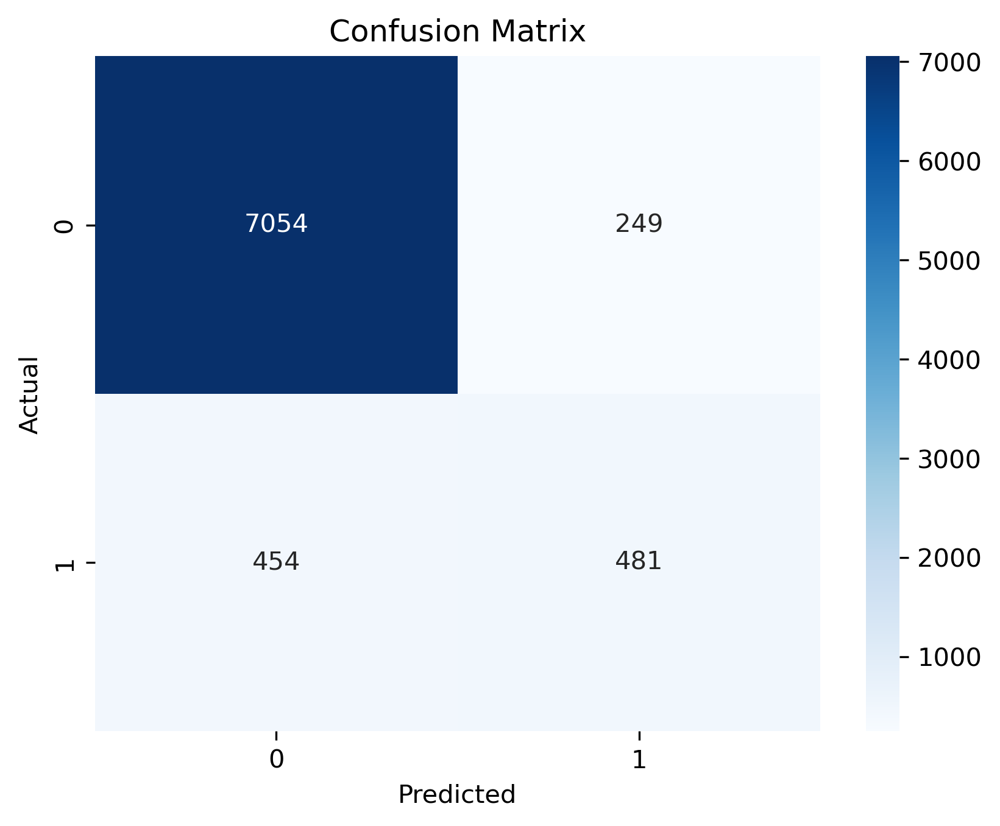
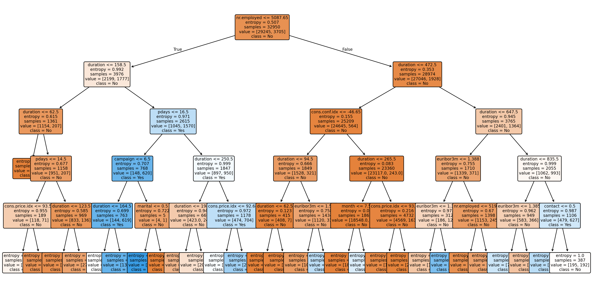

# 🏦 Bank Marketing Campaign – Decision Tree Classification

This project was completed as part of my **GenAI Internship** at **System Tron** (Week 03). The goal was to analyze the **Bank Marketing Dataset** and build a **Decision Tree Classifier** to predict whether a client would subscribe to a term deposit, based on campaign and demographic data.

---

## 🎯 Project Objective

Perform data preprocessing, model training, and evaluation using the **Decision Tree algorithm** on the **Bank Marketing Dataset** to:

* Identify the key factors influencing subscription.
* Build a predictive model with interpretable rules.
* Visualize decision-making paths using a Decision Tree diagram.
* Evaluate performance using metrics and a confusion matrix.

---

## 🛠️ Technologies Used

* Python
* Pandas
* NumPy
* Matplotlib
* Seaborn
* Scikit-learn
* Jupyter Notebook

---

## 📁 Project Structure

```
bank-marketing-decision-tree/
│
├── Decision-tree-bank.ipynb     # Jupyter Notebook with analysis, training, and evaluation
├── bank-additional.zip           # Bank Marketing Dataset (UCI source)
├── decision_tree.png             # Decision Tree visualization
├── confusion_matrix.png          # Confusion Matrix heatmap
├── decision_tree_bank.pkl        # Saved Decision Tree model
├── README.md                     # Project documentation
```

---

## 📊 Dataset Description

The dataset contains marketing campaign data of a Portuguese banking institution. Each row represents a client contacted during a marketing campaign.

Key features include:

* **age** – Age of the client
* **job** – Job type (e.g., admin, technician, retired)
* **marital** – Marital status (married, single, divorced)
* **education** – Education level
* **default** – Has credit in default? (yes/no)
* **housing** – Has housing loan? (yes/no)
* **loan** – Has personal loan? (yes/no)
* **contact** – Communication type (cellular, telephone)
* **month** – Last contact month
* **day\_of\_week** – Last contact day of the week
* **duration** – Last contact duration (in seconds)
* **campaign** – Number of contacts during the campaign
* **pdays** – Days since the client was last contacted
* **previous** – Number of contacts before this campaign
* **poutcome** – Outcome of the previous marketing campaign
* **emp.var.rate**, **cons.price.idx**, **cons.conf.idx**, **euribor3m**, **nr.employed** – Economic indicators
* **y** – Target variable: Has the client subscribed to a term deposit? (yes/no)

---

## 📈 Model Insights

✅ **Top Features Influencing Subscription**

* **duration** – Longer call durations often indicate higher subscription rates.
* **pdays** – Recent contact history impacts the likelihood of subscription.
* **campaign** – Fewer contacts per campaign often correlate with higher success rates.
* **euribor3m** & **nr.employed** – Economic factors influence client decisions.

✅ **Decision Tree Structure**
The decision tree clearly shows splits based on `nr.employed`, `duration`, and `pdays`, providing transparent decision-making rules.

✅ **Confusion Matrix Results**

|                | Predicted No | Predicted Yes |
| -------------- | ------------ | ------------- |
| **Actual No**  | 7054         | 249           |
| **Actual Yes** | 454          | 481           |

* Accuracy: **\~92%**
* Precision (Yes): **65.9%**
* Recall (Yes): **51.4%**

---

## 📷 Sample Visualizations

* 
* 

---

## 🔧 Workflow

1. **Data Loading & Exploration**

   * Imported dataset and checked feature distributions.
   * Handled missing values and encoded categorical variables.

2. **Model Training**

   * Used **DecisionTreeClassifier** from Scikit-learn.
   * Tuned parameters like `max_depth` and `criterion`.

3. **Model Evaluation**

   * Plotted confusion matrix.
   * Calculated accuracy, precision, recall, and F1-score.

4. **Model Export**

   * Saved trained model as `.pkl` for future use.

---

## 🎓 Internship & Task Details

* **Internship Track**: Generative AI (GenAI)
* **Internship Provider**: System Tron
* **Week**: Week 03
* **Task Name**: Bank Marketing – Decision Tree Classification
* **Environment**: Jupyter Notebook

---

## 📬 Contact

* **Difina George**
* 📧 [Gmail](mailto:difina.georgecs@gmail.com)
* 📍 Kerala, India
